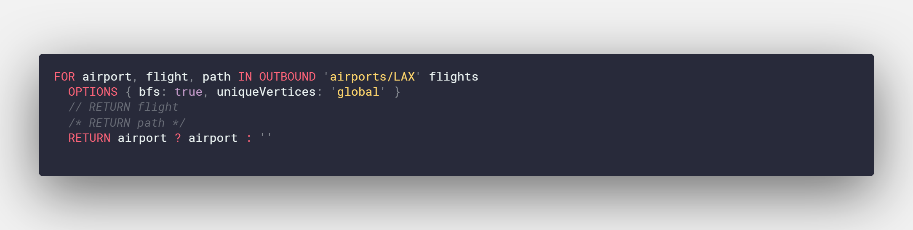
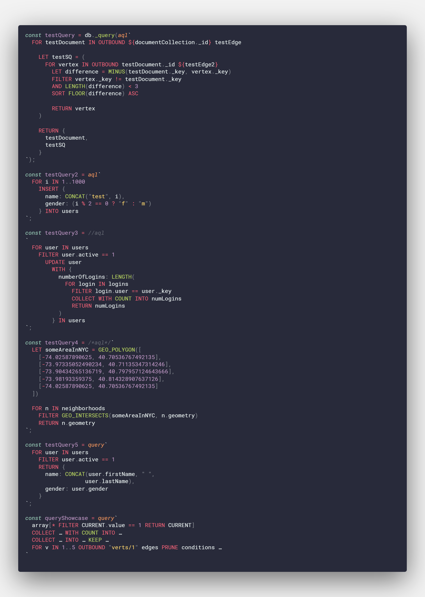

# Syntax Highlighting for ArangoDB Query Language (AQL)

Provides basic syntax highlighting for AQL. This repository was originally inspired and bootstrapped from clintwood's [arango-aql-query](https://github.com/clintwood/arango-aql-query) for Atom Editor and has also taken approaches and formatting from ronsoak's [vsc_redshift_extension](https://github.com/ronsoak/vsc_redshift_extension). ronsoak's [article](https://dev.to/ronsoak/i-built-my-own-vs-code-syntax-highlighter-from-scratch-and-here-s-what-i-learned-1h98) on building a syntax highlighter is also a pleasant read if you are interested in making one for your favorite language.

The highlighter comes with syntax highlighting for template literals to support Foxx and [arangojs](https://github.com/arangodb/arangojs).

## Current Highlighting Support

Keyword highlighting has been taken from [ArangoDB's frontend highlighter](https://github.com/arangodb/arangodb/blob/3.10.0/js/apps/system/_admin/aardvark/APP/react/public/assets/src/mode-aql.js).

Function highlighting is taken from `http://localhost:8529/_db/_system/_api/aql-builtin` and is extracted in raw JSON and processed by name in the data folder.

### Keywords

Patterns matched to keyword.control:

> FOR, RETURN, FILTER, SEARCH, SORT, LIMIT, LET, COLLECT, ASC, DESC, IN, INTO, INSERT, UPDATE, REMOVE, REPLACE, UPSERT, OPTIONS, WITH, AND, OR, NOT, DISTINCT, GRAPH, SHORTEST_PATH, OUTBOUND, INBOUND, ANY, ALL, NONE, AGGREGATE, LIKE, K_SHORTEST_PATHS, PRUNE

### Functions
Patterns matched to support.functions:

> TOKENS, OFFSET_INFO, STARTS_WITH, EXISTS, WITHIN, CHECK_DOCUMENT, CURRENT_USER, COLLECTIONS, CALL_GREENSPUN, V8, IS_SAME_COLLECTION, PARSE_IDENTIFIER, FIRST_DOCUMENT, FIRST_LIST, DATE_TIMEZONES, DATE_TIMEZONE, DATE_TRUNC, DATE_DAYS_IN_MONTH, DATE_LEAPYEAR, DATE_SUBTRACT, DATE_ISOWEEK, DATE_MILLISECOND, DATE_SECOND, DATE_MINUTE, DATE_MONTH, DATE_DAYOFWEEK, DATE_ISO8601, DATE_TIMESTAMP, GEO_MULTILINESTRING, BOOST, DATE_DAYOFYEAR, GEO_LINESTRING, GEO_POLYGON, GEO_MULTIPOINT, GEO_IN_RANGE, GEO_DISTANCE, IS_IN_POLYGON, DISTANCE, DOCUMENT, JSON_PARSE, ZIP, KEEP_RECURSIVE, KEEP, UNSET_RECURSIVE, COLLECTION_COUNT, GEO_EQUALS, MATCHES, MERGE_RECURSIVE, VALUE, VERSION, VALUES, APPLY, CALL, DATE_ROUND, L2_DISTANCE, ASSERT, DATE_FORMAT, L1_DISTANCE, DATE_LOCALTOUTC, COSINE_SIMILARITY, MINHASH, DECAY_GAUSS, INTERLEAVE, REPLACE_NTH, REMOVE_NTH, BOOSTSCORE, ANALYZER, REMOVE_VALUES, UNSHIFT, POP, PUSH, CONTAINS_ARRAY, NTH, FULLTEXT, WITHIN_RECTANGLE, DATE_QUARTER, LAST, FIRST, NGRAM_SIMILARITY, FNV64, AVERAGE, JSON_STRINGIFY, NGRAM_MATCH, ENCODE_URI_COMPONENT, DATE_DIFF, REMOVE_VALUE, IPV4_FROM_NUMBER, NOT_NULL, NGRAM_POSITIONAL_SIMILARITY, LEVENSHTEIN_DISTANCE, APPEND, SHA1, SPLIT, REGEX_REPLACE, DATE_DAY, LEFT, SUBSTITUTE, IS_ARRAY, FIND_LAST, TYPENAME, IS_LIST, TO_LIST, HASH, DEGREES, RANDOM_TOKEN, LTRIM, STDDEV, GEO_POINT, CRC32, DECAY_EXP, IS_OBJECT, MINHASH_MATCH, REGEX_TEST, IS_IPV4, GEO_MULTIPOLYGON, IS_DOCUMENT, POSITION, IS_NUMBER, POW, NOEVAL, LEVENSHTEIN_MATCH, GEO_CONTAINS, TO_HEX, IS_BOOL, TO_BOOL, TO_BASE64, UNION_DISTINCT, COUNT_DISTINCT, SHARD_ID, PASSTHRU, MERGE, IS_NULL, DECAY_LINEAR, IN_RANGE, TRANSLATE, RADIANS, UPPER, REGEX_SPLIT, SCHEMA_VALIDATE, LOWER, MD5, DATE_COMPARE, CHAR_LENGTH, TAN, BIT_TO_STRING, TO_ARRAY, SLEEP, SCHEMA_GET, DECODE_REV, TO_STRING, MAX, IS_DATESTRING, CONCAT, DATE_HOUR, TO_NUMBER, FIND_FIRST, TFIDF, VARIANCE_SAMPLE, RIGHT, CONTAINS, SUBSTRING_BYTES, RTRIM, TRIM, SUBSTRING, UUID, EXP2, FLOOR, PREGEL_RESULT, DATE_UTCTOLOCAL, ATTRIBUTES, MEDIAN, CEIL, ROUND, MIN, ABS, BIT_XOR, STDDEV_SAMPLE, CONCAT_SEPARATOR, SQRT, GEO_INTERSECTS, BIT_SHIFT_RIGHT, BIT_FROM_STRING, LOG, SHIFT, RAND, RANGE, LOG10, EXP, COS, ASIN, IS_STRING, ACOS, BM25, KEYS, COUNT_UNIQUE, DATE_ADD, ATAN, REVERSE, ATAN2, IPV4_TO_NUMBER, SOUNDEX, PI, NEAR, AVG, SORTED, BIT_AND, LOG2, FLATTEN, FAIL, BIT_OR, HAS, BIT_NEGATE, MIN_MATCH, NOOPT, BIT_TEST, SLICE, WARN, SHA512, BIT_SHIFT_LEFT, PHRASE, BIT_CONSTRUCT, BIT_DECONSTRUCT, DATE_YEAR, MINHASH_ERROR, REGEX_MATCHES, MINHASH_COUNT, UNION, MINUS, VARIANCE_POPULATION, OUTERSECTION, DATE_NOW, JACCARD, IS_KEY, LENGTH, CURRENT_DATABASE, COUNT, UNSET, SUM, PERCENTILE, INTERSECTION, SIN, VARIANCE, LIKE, BIT_POPCOUNT, STDDEV_POPULATION, PRODUCT, UNIQUE, GEO_AREA, SORTED_UNIQUE

### Comments

Pattern matched to comment.single:

> Any line starting with a double forward-slash //

Pattern matched to comment.block:

> Any block starting with a forward-slash and an asterisk /* ending with an asterisk and forward-slash */

### Strings

Patterns matched to string.quoted:

> Any string that is encapsulated by single ('), double ("), or template literal (`) quotes

### Numbers

Pattern matched to constant.numeric:

> Any decimal number

### Constants

Pattern matched to constant.language:

> Any boolean values (true, false) + null operator

Pattern matched to keyword.operator:

> Any non-word comparison or arithmetic operator (except ternary) available at [https://www.arangodb.com/docs/stable/aql/operators.html](https://www.arangodb.com/docs/stable/aql/operators.html)

## Roadmap

### Highlighting
- [x] Ternary Operator
- [x] Parenthesis, Array, and Object wrapping (with expressions)
- [ ] Variables (from @, LET, and RETURN)

### Language Features
- [ ] Implement and integrate a [language server](https://code.visualstudio.com/api/language-extensions/language-server-extension-guide) for autocompletion, error-checking, jump-to-definitions, etc... through the [Language Server Protocol (LSP)](https://langserver.org/) for multi-editor support.
